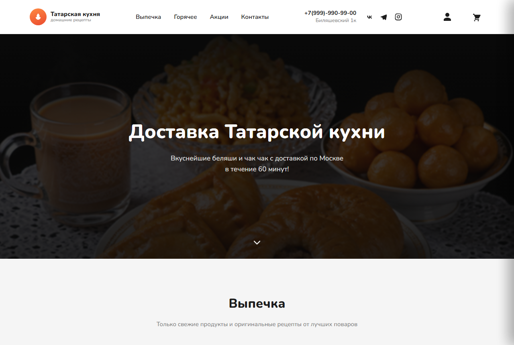
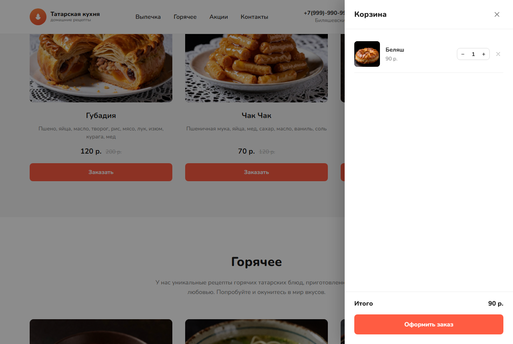
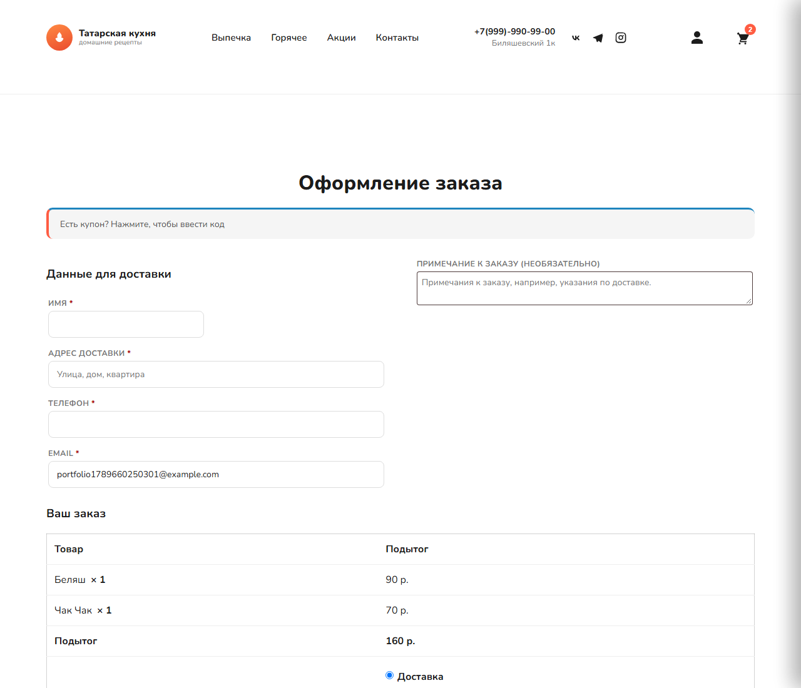
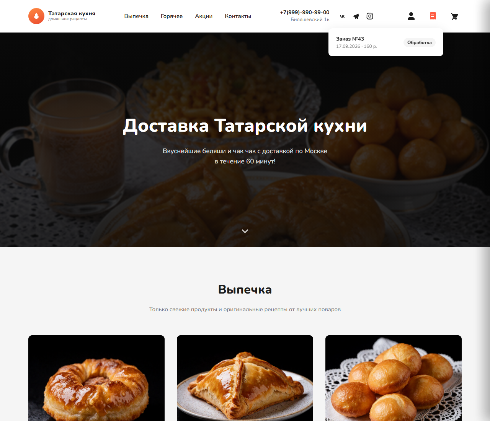
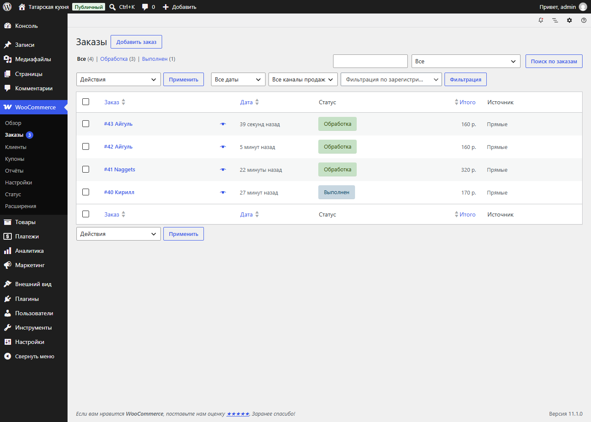
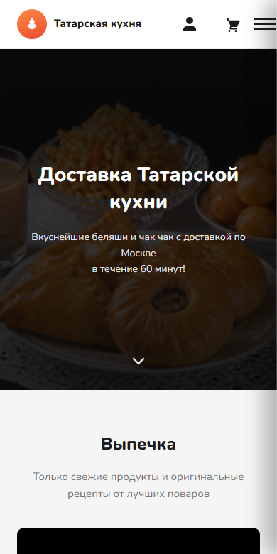
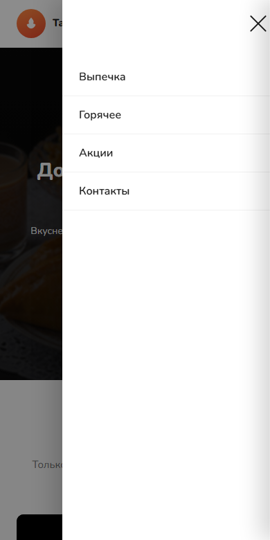

# 🥟 Татарская кухня — сайт доставки еды

Проект прошёл полный путь от статичного лендинга до рабочего интернет-магазина: каталог товаров, корзина, обязательная авторизация клиента, доставка/самовывоз, оплата и панель обработки заказов для менеджера — на связке **WordPress + WooCommerce** поверх кастомной темы, написанной с нуля под готовый дизайн.

<p align="center">
  
</p>

## Демонстрация

| | |
|---|---|
|  |  |
| Корзина — выезжающая панель с AJAX-обновлением, без перезагрузки страницы | Упрощённый чекаут: один адрес доставки, обязательная авторизация |
|  |  |
| Своя иконка в шапке — статус последнего заказа без захода в личный кабинет | Панель обработки заказов для менеджера (WooCommerce → Заказы) |
|  |  |
| Адаптивная вёрстка | Мобильное меню-бургер |

## О проекте

Задача росла в процессе работы с клиентом — именно так это выглядит в реальных заказах:

1. **Лендинг** по готовому дизайн-макету — чистые HTML/CSS/JS без сборщиков.
2. **Каталог и корзина** — клиент выбирает блюда и добавляет их в корзину.
3. **Выбор способа получения** — доставка (с адресом) или самовывоз.
4. **Полноценный бэкенд** — авторизация клиента, база данных, обработка заказов силами реального менеджера, а не заглушки на `localStorage`.

Каждый этап — рабочий, самодостаточный результат, а не черновик: это видно и по истории коммитов.

## Что реализовано

### Витрина (`index.html`, `style.css`, `script.js`)

- Адаптивная вёрстка шапки, hero-баннера, каталога, слайдера акций и футера с картой (Яндекс.Карты).
- Мобильное меню-бургер, выезжающее поверх контента без сдвига остальной страницы.
- Слайдер акций с автопрокруткой, стрелками и точками-индикаторами.

### Бэкенд: кастомная тема WordPress + WooCommerce (`wordpress/theme/tatarskaya-kuhnya`)

- **Каталог из реальных товаров** — карточки на главной странице рендерятся из WooCommerce (`wc_get_products`), а не захардкожены; добавление в корзину — через встроенный AJAX-механизм WooCommerce (без перезагрузки страницы).
- **Корзина** — тот же дизайн панели, что и в статичной версии, но подключён к настоящей корзине WooCommerce через собственные лёгкие AJAX-эндпоинты (количество, удаление позиций, итог).
- **Обязательная авторизация клиента** — оформить заказ можно только зарегистрировавшись или войдя; регистрация не требует подтверждения по почте.
- **Один адрес вместо двух** — из чекаута убран отдельный «Платёжный адрес» (стандартная избыточность WooCommerce для инвойсинга), остался только адрес доставки; переименованы системные подписи форм под задачу.
- **Доставка / самовывоз** — реализовано через зоны доставки WooCommerce; при самовывозе поле адреса не просто скрывается, а становится необязательным и на сервере (проверка на подмену данных).
- **Своя иконка статуса заказа** — не стандартный «Личный кабинет» с десятком вкладок, а компактный выпадающий список номеров и статусов заказов прямо из шапки сайта.
- **Личный кабинет сведён к списку заказов** — из меню убраны вкладки «Загрузки», «Реквизиты», «Адреса», не нужные для этого бизнеса.
- **Оплата и локализация** — оплата наличными/картой курьеру, рубли с правильным форматированием (`90 р.` вместо `$90.00`), полная русская локализация интерфейса WooCommerce.
- **Панель обработки заказов** — стандартный экран WooCommerce → Заказы вwp-admin: менеджер видит номер, статус, сумму, способ получения без какой-либо самописной админки.

## Технологии

**Фронтенд:** HTML5, CSS3 (Flexbox/Grid, CSS-переменные, медиа-запросы), vanilla JavaScript — без фреймворков и сборщиков.

**Бэкенд:** WordPress (кастомная классическая тема), WooCommerce (каталог/корзина/заказы/аккаунты), PHP, MySQL, jQuery + AJAX (`admin-ajax.php`), хуки и фильтры WooCommerce для тонкой настройки чекаута под задачу.

**Тестирование:** сценарии сквозной проверки на Playwright (регистрация → добавление в корзину → оформление заказа → проверка в панели менеджера), включая проверку обоих способов получения заказа.

## Структура репозитория

```
├── index.html, style.css, script.js   — статическая версия лендинга
├── assets/img/                        — изображения блюд и промо-слайдов
├── wordpress/
│   ├── theme/tatarskaya-kuhnya/       — кастомная тема WordPress + WooCommerce
│   │   ├── functions.php              — регистрация темы, подключение скриптов
│   │   ├── header.php, footer.php     — шапка/футер, разметка корзины
│   │   ├── front-page.php             — каталог из реальных товаров WooCommerce
│   │   ├── inc/                       — хуки WooCommerce, AJAX-эндпоинты корзины и заказов
│   │   └── assets/                    — стили, скрипты, изображения темы
│   ├── scripts/                       — идемпотентные скрипты установки (импорт товаров, зоны доставки)
│   └── SETUP.md                       — пошаговая инструкция разворачивания на хостинге
└── docs/screenshots/                  — скриншоты для этого README
```

## Как запустить

### Статическая версия

```
python -m http.server 8080
```

и открыть `http://localhost:8080`.

### WordPress-версия

Нужен WordPress с установленным WooCommerce. Полная инструкция — в [`wordpress/SETUP.md`](wordpress/SETUP.md): установка WooCommerce, загрузка темы, настройка валюты/страны/оплаты/доставки и запуск скриптов импорта товаров.

## Автор

Реализация лендинга, корзины и полной интеграции с WordPress/WooCommerce — включая архитектурные решения по упрощению чекаута и авторизации под задачу конкретного бизнеса.
